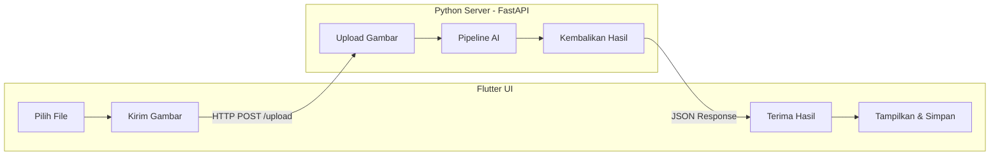

# 📘 Manga Comic Auto Translator Reader

[](https://opensource.org/licenses/MIT)
[](https://www.python.org/)
[](https://flutter.dev/)
[](https://fastapi.tiangolo.com/)

**Manga Comic Auto Translator Reader** adalah aplikasi pembaca komik/manga yang dilengkapi fitur penerjemahan otomatis. Aplikasi ini memungkinkan pengguna untuk mengimpor file komik mentah (raw) dalam format PDF, CBZ, atau ZIP, lalu secara otomatis mendeteksi, membaca, dan menerjemahkan teks di dalam balon dialog dari bahasa Jepang ke bahasa Indonesia (atau bahasa lainnya).

> **Visi:** Menjembatani kesenjangan bahasa dalam menikmati manga dan komik secara instan, tanpa menunggu rilisan scanlation.

---

## ✨ Fitur Utama

- 📂 **Dukungan Multi‑Format**: Impor file `.pdf`, `.cbz`, `.zip`, atau folder gambar.
- 🤖 **Deteksi Balon Otomatis**: Menggunakan model YOLOv8 untuk menemukan gelembung dialog.
- 🔤 **OCR Khusus Manga**: MangaOCR membaca teks Jepang vertikal dan *furigana* dengan akurat.
- 🌐 **Penerjemahan Offline**: Sugoi Translator (atau fallback ke Google Translate) menerjemahkan teks ke bahasa pilihan.
- 🎨 **Penghapusan Teks Asli**: Inpainting dengan LaMa menghapus teks Jepang dan menyisipkan hasil terjemahan.
- 📱 **Cross‑Platform**: Frontend Flutter berjalan di **Linux**, **Windows**, **macOS**, dan **Android**.
- 🔒 **Privasi Terjaga**: Semua pemrosesan AI dilakukan secara **lokal** di perangkat pengguna.

---

## 🧰 Teknologi yang Digunakan

| Komponen          | Teknologi / Library                                                                 |
| :---------------- | :---------------------------------------------------------------------------------- |
| **Frontend**      | Flutter (Dart) – UI responsif dan animasi halus.                                    |
| **Backend API**   | FastAPI (Python) – Server lokal yang ringan dan cepat.                              |
| **Deteksi Balon** | YOLOv8 (Ultralytics) – Model object detection yang di‑fine‑tune untuk manga.        |
| **OCR**           | MangaOCR – Model transformer khusus untuk teks Jepang vertikal.                     |
| **Penerjemahan**  | Sugoi Translator (offline) / DeepL API / Google Translate (fallback).                |
| **Inpainting**    | LaMa (Large Mask Inpainting) – Mengisi area kosong bekas teks dengan mulus.         |
| **Manajemen File**| comicpy – Ekstraksi dan pengemasan ulang file komik.                                |
| **Komunikasi**    | REST API lokal (HTTP) – Flutter berkomunikasi dengan server Python melalui `dio`.   |

---

## 🏗️ Arsitektur Sistem



## 🚀 Cara Menjalankan

### Backend

```bash
cd backend
python3 -m venv venv
source venv/bin/activate
pip install --upgrade pip
pip install fastapi[standard] ultralytics manga-ocr comicpy opencv-python Pillow torch torchvision torchaudio
uvicorn server.main:app --reload --host 0.0.0.0 --port 8000
```

### Frontend

```bash
cd frontend
flutter pub get
flutter run
```

Pastikan Flutter SDK terpasang dan tersedia di `PATH`.

## 🗂️ Struktur Proyek

- `backend/server/main.py` — FastAPI backend utama.
- `backend/core/ocr.py` — logika MangaOCR.
- `backend/uploads/` — penyimpanan sementara file upload.
- `frontend/` — aplikasi Flutter.

## 🧹 Catatan GitHub

Jangan commit file-file lokal seperti:
- `venv/`, `.venv/`, `env/`
- `backend/uploads/`, `backend/temp/`, `backend/outputs/`
- file `.env` atau `*.secret`
- folder build Flutter seperti `frontend/build/` dan `frontend/.dart_tool/`
