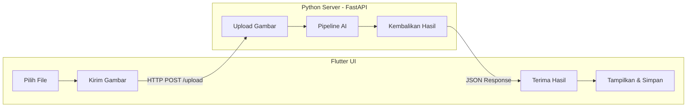

# 📘 Manga Comic Auto Translator Reader

[](https://opensource.org/licenses/MIT)
[](https://www.python.org/)
[](https://flutter.dev/)
[](https://fastapi.tiangolo.com/)
[](https://github.com/danuwarisman/Manga-Comic-Auto-Translator-Reader)

**Manga Comic Auto Translator Reader** adalah aplikasi pembaca komik/manga yang dilengkapi fitur penerjemahan otomatis. Aplikasi ini memungkinkan pengguna untuk mengimpor file komik mentah (raw) dalam format PDF, CBZ, atau ZIP, lalu secara otomatis mendeteksi, membaca, dan menerjemahkan teks di dalam balon dialog dari bahasa Jepang ke bahasa Indonesia (atau bahasa lainnya).

> **Visi:** Menjembatani kesenjangan bahasa dalam menikmati manga dan komik secara instan, tanpa menunggu rilisan scanlation.

---

## 📊 Project Status

**Sprint 1 ✅ COMPLETE** (April 22, 2026)
- ✅ Removed duplicate `/server/` folder structure  
- ✅ Created `backend/requirements.txt` for proper dependency management
- ✅ Fixed Android App ID (`com.manga_translator.reader`)
- ✅ Updated Flutter dependencies (dio, file_picker, provider, cached_network_image, etc.)
- ✅ Implemented complete Flutter UI foundation:
  - Home screen with file upload widget
  - Results viewer with pagination
  - API service layer for backend communication
  - State management using Provider pattern
  - Data models for type safety

**Next Sprint: Backend Feature Implementation**
- Implement YOLO model for text balloon detection
- Implement LaMa for inpainting (text removal/replacement)
- Integrate translation API (Sugoi/Google/DeepL)
- Add CBZ/PDF file handling

---

## ✨ Fitur Utama

- 📂 **Dukungan Multi‑Format**: Impor file `.pdf`, `.cbz`, `.zip`, atau folder gambar.
- 🤖 **Deteksi Balon Otomatis**: Menggunakan model YOLOv8 untuk menemukan gelembung dialog.
- 🔤 **OCR Khusus Manga**: MangaOCR membaca teks Jepang vertikal dan *furigana* dengan akurat.
- 🌐 **Penerjemahan Offline**: Sugoi Translator (atau fallback ke Google Translate) menerjemahkan teks ke bahasa pilihan.
- 🎨 **Penghapusan Teks Asli**: Inpainting dengan LaMa menghapus teks Jepang dan menyisipkan hasil terjemahan.
- 📱 **Cross‑Platform**: Frontend Flutter berjalan di **Linux**, **Windows**, **macOS**, dan **Android**.
- 🔒 **Privasi Terjaga**: Semua pemrosesan AI dilakukan secara **lokal** di perangkat pengguna.

---

## 🧰 Teknologi yang Digunakan

| Komponen          | Teknologi / Library                                                                 |
| :---------------- | :---------------------------------------------------------------------------------- |
| **Frontend**      | Flutter (Dart) – UI responsif dan animasi halus.                                    |
| **Backend API**   | FastAPI (Python) – Server lokal yang ringan dan cepat.                              |
| **Deteksi Balon** | YOLOv8 (Ultralytics) – Model object detection yang di‑fine‑tune untuk manga.        |
| **OCR**           | MangaOCR – Model transformer khusus untuk teks Jepang vertikal.                     |
| **Penerjemahan**  | Sugoi Translator (offline) / DeepL API / Google Translate (fallback).                |
| **Inpainting**    | LaMa (Large Mask Inpainting) – Mengisi area kosong bekas teks dengan mulus.         |
| **Manajemen File**| comicpy – Ekstraksi dan pengemasan ulang file komik.                                |
| **Komunikasi**    | REST API lokal (HTTP) – Flutter berkomunikasi dengan server Python melalui `dio`.   |

---

## 🏗️ Arsitektur Sistem



## 🚀 Cara Menjalankan

### Prerequisites
- Python 3.10+
- Flutter SDK 3.38+ (dengan Dart)
- Git

### Backend

```bash
cd backend
python3 -m venv venv
source venv/bin/activate  # Windows: venv\Scripts\activate
pip install --upgrade pip
pip install -r requirements.txt
uvicorn server.main:app --reload --host 0.0.0.0 --port 8000
```

Server akan berjalan di `http://localhost:8000`

### Frontend

```bash
cd frontend
flutter pub get
flutter run
```

Pastikan Backend sudah berjalan sebelum menjalankan Frontend.

## 🗂️ Struktur Proyek

```
Manga-Comic-Auto-Translator-Reader/
├── backend/
│   ├── core/
│   │   ├── __init__.py
│   │   └── ocr.py                    # MangaOCR processor
│   ├── server/
│   │   ├── __init__.py
│   │   └── main.py                   # FastAPI application
│   ├── models/                       # AI model weights (to be added)
│   ├── uploads/                      # Temporary file storage
│   ├── requirements.txt              # Python dependencies
│   └── venv/                         # Virtual environment (git ignored)
│
├── frontend/
│   ├── lib/
│   │   ├── main.dart                 # App entry point
│   │   ├── models/
│   │   │   └── translation_model.dart
│   │   ├── screens/
│   │   │   ├── home_screen.dart
│   │   │   └── results_screen.dart
│   │   ├── services/
│   │   │   └── api_service.dart      # Backend API client
│   │   ├── providers/
│   │   │   └── translation_provider.dart  # State management
│   │   └── widgets/
│   │       └── file_upload_widget.dart
│   ├── pubspec.yaml                  # Flutter dependencies
│   ├── android/                      # Android configuration
│   ├── ios/                          # iOS configuration
│   └── ...
│
├── README.md                          # This file
├── CONTRIBUTING.md                    # Contribution guidelines
├── SPRINT_1_FIXES.md                  # Sprint 1 summary
├── setup.sh                           # Setup script (Linux/macOS)
└── .gitignore                         # Git ignore rules
```

## 🧹 Catatan GitHub

Jangan commit file-file lokal seperti:
- `venv/`, `.venv/`, `env/`
- `backend/uploads/`, `backend/temp/`, `backend/outputs/`
- file `.env` atau `*.secret`
- folder build Flutter seperti `frontend/build/` dan `frontend/.dart_tool/`
