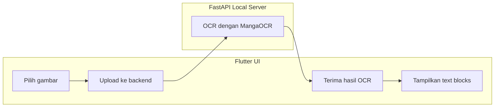

# 📘 Manga Comic Auto Translator Reader

[](https://opensource.org/licenses/MIT)
[](https://www.python.org/)
[](https://flutter.dev/)
[](https://fastapi.tiangolo.com/)
[](https://github.com/danuwarisman/Manga-Comic-Auto-Translator-Reader)

**Manga Comic Auto Translator Reader** adalah aplikasi pembaca komik/manga dengan fondasi penerjemahan otomatis. Saat ini repo berada pada tahap **MVP OCR**, yaitu pengguna dapat mengunggah gambar manga/komik ke backend lokal FastAPI dan melihat hasil ekstraksi teks di frontend Flutter.

> **Visi:** Menjembatani kesenjangan bahasa dalam menikmati manga dan komik secara instan, tanpa menunggu rilisan scanlation.

---

## 📊 Project Status

**Sprint 1 ✅ COMPLETE** (April 22, 2026)

Yang sudah tersedia saat ini:
- ✅ Struktur proyek dirapikan ke `backend/` dan `frontend/`
- ✅ `backend/requirements.txt` tersedia untuk dependency Python
- ✅ Android App ID sudah diperbarui (`com.manga_translator.reader`)
- ✅ Fondasi UI Flutter sudah tersedia:
  - upload file/gambar
  - state management dengan Provider
  - service layer untuk komunikasi ke backend
  - halaman hasil OCR
- ✅ Backend FastAPI sudah tersedia untuk:
  - health check
  - upload image
  - OCR inference menggunakan MangaOCR
- ✅ Kontrak API frontend dan backend sudah diselaraskan untuk **OCR MVP**

**Status implementasi saat ini**
- Backend saat ini **belum** menjalankan pipeline terjemahan penuh
- Backend saat ini **belum** menghasilkan preview gambar terjemahan
- Frontend saat ini menampilkan **hasil OCR text blocks** dari backend MVP

---

## ✨ Fitur Saat Ini

- 📂 **Upload Gambar**: Upload file gambar untuk diproses OCR
- 🔤 **OCR Jepang/Manga**: Menggunakan MangaOCR untuk membaca teks dari gambar
- 🖥️ **Backend Lokal**: FastAPI berjalan secara lokal di `localhost:8000`
- 📱 **Frontend Flutter**: UI upload, status, dan tampilan hasil OCR
- 🩺 **Health Check API**: Endpoint health untuk validasi koneksi frontend-backend
- 🧱 **Fondasi Arsitektur**: Sudah siap dilanjutkan ke tahap deteksi balon, translasi, dan inpainting

---

## 🚧 Belum Tersedia di MVP Saat Ini

Fitur berikut masih ada di roadmap dan **belum aktif penuh** di implementasi sekarang:
- Deteksi balon dialog dengan YOLOv8
- Penghapusan teks dengan LaMa
- Translasi otomatis ke bahasa target
- Dukungan pipeline penuh PDF / CBZ / ZIP
- Status job asynchronous dan download hasil akhir
- Preview gambar original vs translated dari backend

---

## 🧰 Teknologi yang Digunakan

| Komponen | Teknologi / Library |
| :-- | :-- |
| **Frontend** | Flutter (Dart), Provider, Dio |
| **Backend API** | FastAPI (Python), Uvicorn |
| **OCR** | MangaOCR |
| **Image Processing** | Pillow, OpenCV |
| **Roadmap AI** | YOLOv8, LaMa, Sugoi / DeepL / Google Translate |

---

## 🏗️ Arsitektur Sistem Saat Ini



---

## 🔌 API yang Tersedia Saat Ini

### Root
- `GET /`
- Mengembalikan pesan bahwa backend aktif

### Health Check
- `GET /health`
- `GET /api/health`
- Mengembalikan status backend dan kesiapan OCR engine

Contoh response:
```json
{
  "status": "healthy",
  "ocr_ready": true,
  "ocr_error": null
}
```

### Upload OCR
- `POST /upload`
- `POST /api/translate/upload`

Form data:
- `file`: file gambar
- `target_language`: string, default `english`

Contoh response:
```json
{
  "file_name": "sample.jpg",
  "status": "completed",
  "target_language": "english",
  "created_at": "2026-04-22T02:00:00+00:00",
  "pages": [
    {
      "page_number": 1,
      "original_image_url": "",
      "translated_image_url": "",
      "text_blocks": [
        {
          "original_text": "こんにちは",
          "translated_text": "",
          "confidence": 0.0
        }
      ],
      "status": "completed"
    }
  ],
  "texts": [
    {
      "text": "こんにちは",
      "bbox": null,
      "confidence": null
    }
  ]
}
```

> Catatan: field `translated_text` dan preview image masih placeholder pada MVP saat ini.

---

## 🚀 Cara Menjalankan

### Prerequisites
- Python 3.10+
- Flutter SDK 3.38+
- Git

### Backend

```bash
cd backend
python3 -m venv venv
source venv/bin/activate
pip install --upgrade pip
pip install -r requirements.txt
uvicorn server.main:app --reload --host 0.0.0.0 --port 8000
```

Backend berjalan di:
- `http://localhost:8000`

### Frontend

```bash
cd frontend
flutter pub get
flutter run
```

Pastikan backend sudah berjalan sebelum frontend digunakan.

---

## 🗂️ Struktur Proyek

```text
Manga-Comic-Auto-Translator-Reader/
├── backend/
│   ├── core/
│   │   ├── __init__.py
│   │   └── ocr.py
│   ├── server/
│   │   ├── __init__.py
│   │   └── main.py
│   ├── models/
│   ├── uploads/
│   └── requirements.txt
├── frontend/
│   ├── lib/
│   │   ├── main.dart
│   │   ├── models/
│   │   │   └── translation_model.dart
│   │   ├── providers/
│   │   │   └── translation_provider.dart
│   │   ├── screens/
│   │   │   ├── home_screen.dart
│   │   │   └── results_screen.dart
│   │   ├── services/
│   │   │   └── api_service.dart
│   │   └── widgets/
│   │       └── file_upload_widget.dart
│   ├── pubspec.yaml
│   └── ...
├── README.md
├── SPRINT_1_FIXES.md
├── setup.sh
└── .gitignore
```

---

## 🧹 Catatan GitHub

Jangan commit file lokal atau artefak runtime seperti:
- `venv/`, `.venv/`, `env/`
- `backend/uploads/`, `backend/temp/`, `backend/outputs/`
- `backend/models/`
- file `.env`, `.env.*`, `*.secret`
- artefak build Flutter seperti `frontend/build/` dan `frontend/.dart_tool/`

---

## 🛣️ Roadmap Berikutnya

### Sprint 2
- Implement text balloon detection dengan YOLOv8
- Tambahkan pipeline terjemahan nyata
- Tambahkan inpainting / penggantian teks
- Tambahkan dukungan PDF / CBZ / ZIP
- Tambahkan struktur response hasil terjemahan final

### Sprint 3
- Tambahkan testing backend dan frontend
- Tambahkan `.env.example`
- Tambahkan CI/CD
- Tambahkan logging dan validasi input yang lebih ketat
- Rapikan CORS dan konfigurasi deployment/dev

---

## 🔄 Pembaruan Terbaru

**April 25, 2026**
- Menyelesaikan perbaikan error pada backend dan frontend:
  - Memperbaiki versi `manga-ocr` di `requirements.txt`
  - Mengganti penggunaan `withOpacity` yang deprecated di Flutter
- Menyelaraskan file `.gitignore` untuk menghindari commit file yang tidak diperlukan
- Memastikan backend dan frontend berjalan tanpa error

**Rencana Selanjutnya:**
- Implementasi YOLO untuk deteksi balon teks
- Implementasi LaMa untuk inpainting (menghapus teks)
- Integrasi API terjemahan (Sugoi/Google/DeepL)
- Penanganan file CBZ/PDF

---

## 📝 Ringkasan Penting

Repo ini sekarang **sinkron antara frontend, backend, dan dokumentasi untuk mode OCR MVP**. Jika Anda menjalankan proyek sekarang, yang akan berfungsi adalah:
- health check backend
- upload gambar ke backend
- OCR hasil teks
- tampilan hasil OCR di Flutter

Pipeline translasi komik penuh masih merupakan tahap pengembangan berikutnya.
